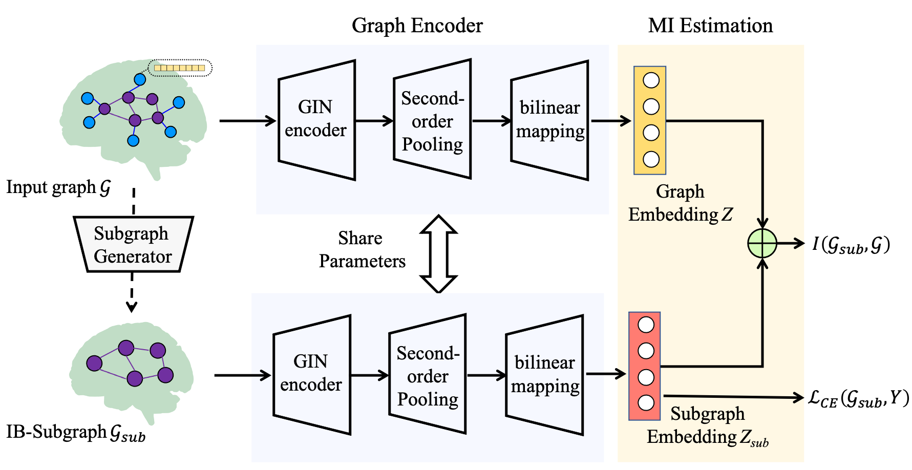

<h2 align="center">

Brain Information Bottleneck (BrainIB) 🔥

</h2>

## Information Bottleneck (IB) and its Objective

Given input and corresponding desired output , the overall goal of the IB principle [1] is to learn a latent representation that is maximally predictive to and contains as little information of as possible. Formally, the objective of IB can be formulated as:

```math 
\max _{p(t \mid x)} I(Y ; T)-\beta I(X ; T),
```
where denotes mutual information and is a Lagrange multiplier that controls the trade-off between the **sufficiency** (the performance to down-stream task, as measured by $\max I(Y;T)$) and the **minimality** (the complexity of the representation, as quantified by $\min I(X;T)$).

To implement IB with deep neural networks, the maximization of equals to the minimization of cross-entropy loss; whereas the minimization of differs in each method by mutual information variational or non-parametric upper bounds. **BrainIB estimates  by the matrix-based Renyi’s  α-order entropy [2，3] without any approximations or distributional assumptions.**

## Overall framework

****

**Figure 1 The overview of the pipeline.** The resting-state fMRI raw data are preprocessed and then parcellated into regions of interest (ROIs) according to the automated anatomical labelling (AAL) atlas. The functional connectivity (FC) matrices are calculated using Pearson correlation between ROIs. From the FC we construct the brain functional graph G = {A,X}, where A is the graph adjacency matrix characterizing the graph structure and X is node feature matrix. Specifically, A is a binarized FC matrix, where only the top 20-percentile absolute values of the correlations of the matrix are transformed into ones, while the rest are transformed into zeros.  For node feature $X$, $X_{k}$ for node $k$ can be defined as $X_{k}=\left [ \rho_{k1},\dots, \rho_{kn}\right ] ^{\text{T}}$ , where $\rho_{kl}$ is the Pearson’s correlation coefficient for node $k$ and node $l$. Note that, we only consider functional connectivity values as node features, which is common in brain network analysis [4]. Finally, the functional graph is fed to BrainIB for psychiatric classification.

## The Architecture of BrainIB



**Figure 2 Architecture of our proposed BrainIB.** BrainIB consists of three modules: subgraph generator, graph encoder, and mutual information estimation module. The subgraph generator is used to sample subgraph G from the original graph Gsub. The graph encoder is used to learn graph embeddings.The mutual information estimation module evaluates the mutual information between G or Gsub. 

```math 
\max I(Y;\mathcal{G}_{\text{sub}} )-\beta I(\mathcal{G};\mathcal{G}_{\text{sub}}),
```

where $ \mathcal{G} $ is input graph.  

$ \mathcal{G}_{\text{sub}}=\mathcal{G}\odot M, $

where $M$ is subgraph mask, $Y$ is corresponding graph label.

## Our Implementation Details
```math 
\max I(Y;\mathcal{G}_{\text{sub}})\Leftrightarrow \min \mathcal{L}_{CE} (Y;\mathcal{G}_{\text{sub}}),
```
where $\mathcal{L}_{CE}$ is the cross-entropy loss.

```math 
I(\mathcal{G}; \mathcal{G}_{\text{sub}}) \Leftrightarrow I(Z;Z_{\text{sub}}), 
```

where $Z=\varphi (\mathcal{G} )$, $\varphi$ is GIN encoder.

## Stable Training

We use matrix-based Renyi’s  α-order mutual information to estimate , which significantly stabilizes the training.


**Figure 3 Training dynamics of $I(\mathcal{G};\mathcal{G}_{\text{sub}})$(MI_loss) in SIB [5], BrainIB over 1000 epochs on REST-meta-MDD and ABIDE.** $I(\mathcal{G};\mathcal{G}_{\text{sub}})$ is the mutual information between subgraph and input graph. The training process of BrainIB is stable, while SIB suffers from an unstable training process and inaccurate estimation of mutual information between subgraph and input graph. 

## Generalization Performance

BrainIB achieves better accuracy for the leave-one-site-out cross validation on REST-meta-MDD and ABIDE.

Table 1 Leave-one-site-out cross validation on REST-meta-MDD and ABIDE. The highest performance is highlighted with bold face.

<table class="tg">
<thead>
  <tr>
    <th class="tg-2xbj" colspan="4">   <br>Rest-meta-MDD   </th>
    <th class="tg-2xbj" colspan="4">   <br>ABIDE   </th>
  </tr>
</thead>
<tbody>
  <tr>
    <td class="tg-7btt">   <br>Site   </td>
    <td class="tg-7btt">   <br>DIR-GNN   </td>
    <td class="tg-7btt">   <br>ProtGNN   </td>
    <td class="tg-7btt">   <br>BrainIB   </td>
    <td class="tg-7btt">   <br>Site   </td>
    <td class="tg-7btt">   <br>DIR-GNN   </td>
    <td class="tg-7btt">   <br>ProtGNN   </td>
    <td class="tg-7btt">   <br>BrainIB   </td>
  </tr>
  <tr>
    <td class="tg-c3ow">   <br>site1   </td>
    <td class="tg-c3ow">   <br>56.8%   </td>
    <td class="tg-c3ow">   <br>56.8%   </td>
    <td class="tg-7btt">   <br>63.3%   </td>
    <td class="tg-c3ow">   <br>CMU   </td>
    <td class="tg-7btt">   <br>83.3%   </td>
    <td class="tg-c3ow">   <br>75.0%   </td>
    <td class="tg-7btt">   <br>83.3%   </td>
  </tr>
  <tr>
    <td class="tg-c3ow">   <br>site2   </td>
    <td class="tg-7btt">   <br>70.0%   </td>
    <td class="tg-7btt">   <br>70.0%   </td>
    <td class="tg-7btt">   <br>70.0%   </td>
    <td class="tg-c3ow">   <br>CALTECH   </td>
    <td class="tg-c3ow">   <br>68.4%   </td>
    <td class="tg-c3ow">   <br>68.4%   </td>
    <td class="tg-7btt">   <br>71.1%   </td>
  </tr>
  <tr>
    <td class="tg-c3ow">   <br>site3   </td>
    <td class="tg-c3ow">   <br>78.0%   </td>
    <td class="tg-c3ow">   <br>68.3%   </td>
    <td class="tg-7btt">   <br>85.4%   </td>
    <td class="tg-c3ow">   <br>KKI   </td>
    <td class="tg-c3ow">   <br>65.5%   </td>
    <td class="tg-c3ow">   <br>65.5%   </td>
    <td class="tg-7btt">   <br>72.7%   </td>
  </tr>
  <tr>
    <td class="tg-c3ow">   <br>site4   </td>
    <td class="tg-c3ow">   <br>75.0%   </td>
    <td class="tg-c3ow">   <br>63.9%   </td>
    <td class="tg-7btt">   <br>77.8%   </td>
    <td class="tg-c3ow">   <br>LEUVEN   </td>
    <td class="tg-c3ow">   <br>68.8%   </td>
    <td class="tg-7btt">   <br>73.4%   </td>
    <td class="tg-7btt">   <br>73.4%   </td>
  </tr>
  <tr>
    <td class="tg-c3ow">   <br>site5   </td>
    <td class="tg-c3ow">   <br>64.4%   </td>
    <td class="tg-c3ow">   <br>63.2%   </td>
    <td class="tg-7btt">   <br>67.8%   </td>
    <td class="tg-c3ow">   <br>MAX_MUN   </td>
    <td class="tg-c3ow">   <br>64.9%   </td>
    <td class="tg-7btt">   <br>68.4%   </td>
    <td class="tg-c3ow">   <br>66.7%   </td>
  </tr>
  <tr>
    <td class="tg-c3ow">   <br>site6   </td>
    <td class="tg-7btt">   <br>68.8%   </td>
    <td class="tg-c3ow">   <br>64.6%   </td>
    <td class="tg-7btt">   <br>68.8%   </td>
    <td class="tg-c3ow">   <br>NYU   </td>
    <td class="tg-c3ow">   <br>63.6%   </td>
    <td class="tg-c3ow">   <br>57.1%   </td>
    <td class="tg-7btt">   <br>70.1%   </td>
  </tr>
  <tr>
    <td class="tg-c3ow">   <br>site7   </td>
    <td class="tg-c3ow">   <br>70.4%   </td>
    <td class="tg-c3ow">   <br>67.6%   </td>
    <td class="tg-7btt">   <br>73.2%   </td>
    <td class="tg-c3ow">   <br>OHSU   </td>
    <td class="tg-7btt">   <br>71.4%   </td>
    <td class="tg-7btt">   <br>71.4%   </td>
    <td class="tg-c3ow">   <br>67.9%   </td>
  </tr>
  <tr>
    <td class="tg-c3ow">   <br>site8   </td>
    <td class="tg-c3ow">   <br>67.6%   </td>
    <td class="tg-7btt">   <br>75.7%   </td>
    <td class="tg-7btt">   <br>75.7%   </td>
    <td class="tg-c3ow">   <br>OLIN   </td>
    <td class="tg-7btt">   <br>77.8%   </td>
    <td class="tg-c3ow">   <br>75.0%   </td>
    <td class="tg-c3ow">   <br>75.0%   </td>
  </tr>
  <tr>
    <td class="tg-c3ow">   <br>site9   </td>
    <td class="tg-7btt">   <br>80.6%   </td>
    <td class="tg-c3ow">   <br>72.2%   </td>
    <td class="tg-c3ow">   <br>75.0%   </td>
    <td class="tg-c3ow">   <br>PITT   </td>
    <td class="tg-7btt">   <br>70.2%   </td>
    <td class="tg-c3ow">   <br>64.9%   </td>
    <td class="tg-c3ow">   <br>66.7%   </td>
  </tr>
  <tr>
    <td class="tg-c3ow">   <br>site10   </td>
    <td class="tg-c3ow">   <br>71.0%   </td>
    <td class="tg-c3ow">   <br>66.7%   </td>
    <td class="tg-7btt">   <br>72.0%   </td>
    <td class="tg-c3ow">   <br>SBL   </td>
    <td class="tg-c3ow">   <br>76.7%   </td>
    <td class="tg-c3ow">   <br>73.3%   </td>
    <td class="tg-7btt">   <br>83.3%   </td>
  </tr>
  <tr>
    <td class="tg-c3ow">   <br>site11   </td>
    <td class="tg-c3ow">   <br>70.0%   </td>
    <td class="tg-c3ow">   <br>64.2%   </td>
    <td class="tg-7btt">   <br>82.1%   </td>
    <td class="tg-c3ow">   <br>SDSU   </td>
    <td class="tg-7btt">   <br>75.0%   </td>
    <td class="tg-c3ow">   <br>72.2%   </td>
    <td class="tg-7btt">   <br>75.0%   </td>
  </tr>
  <tr>
    <td class="tg-c3ow">   <br>site12   </td>
    <td class="tg-c3ow">   <br>64.6%   </td>
    <td class="tg-c3ow">   <br>63.4%   </td>
    <td class="tg-7btt">   <br>67.1%   </td>
    <td class="tg-c3ow">   <br>STANFORD   </td>
    <td class="tg-7btt">   <br>80.0%   </td>
    <td class="tg-c3ow">   <br>72.5%   </td>
    <td class="tg-c3ow">   <br>75.0%   </td>
  </tr>
  <tr>
    <td class="tg-c3ow">   <br>site13   </td>
    <td class="tg-c3ow">   <br>67.3%   </td>
    <td class="tg-c3ow">   <br>65.3%   </td>
    <td class="tg-7btt">   <br>69.4%   </td>
    <td class="tg-c3ow">   <br>TRINITY   </td>
    <td class="tg-c3ow">   <br>67.3%   </td>
    <td class="tg-7btt">   <br>73.5%   </td>
    <td class="tg-c3ow">   <br>65.3%   </td>
  </tr>
  <tr>
    <td class="tg-c3ow">   <br>site14   </td>
    <td class="tg-c3ow">   <br>56.6%   </td>
    <td class="tg-c3ow">   <br>56.8%   </td>
    <td class="tg-7btt">   <br>63.2%   </td>
    <td class="tg-c3ow">   <br>UCLA   </td>
    <td class="tg-c3ow">   <br>68.7%   </td>
    <td class="tg-c3ow">   <br>64.6%   </td>
    <td class="tg-7btt">   <br>74.7%   </td>
  </tr>
  <tr>
    <td class="tg-c3ow">   <br>site15   </td>
    <td class="tg-c3ow">   <br>61.1%   </td>
    <td class="tg-c3ow">   <br>62.5%   </td>
    <td class="tg-7btt">   <br>70.1%   </td>
    <td class="tg-c3ow">   <br>UM   </td>
    <td class="tg-7btt">   <br>66.2%   </td>
    <td class="tg-c3ow">   <br>62.8%   </td>
    <td class="tg-c3ow">   <br>64.8%   </td>
  </tr>
  <tr>
    <td class="tg-c3ow">   <br>site16   </td>
    <td class="tg-c3ow">   <br>68.4%   </td>
    <td class="tg-7btt">   <br>73.7%   </td>
    <td class="tg-c3ow">   <br>71.1%   </td>
    <td class="tg-c3ow">   <br>USM   </td>
    <td class="tg-c3ow">   <br>67.3%   </td>
    <td class="tg-c3ow">   <br>61.4%   </td>
    <td class="tg-7btt">   <br>73.3%   </td>
  </tr>
  <tr>
    <td class="tg-c3ow">   <br>site17   </td>
    <td class="tg-c3ow">   <br>68.9%   </td>
    <td class="tg-7btt">   <br>71.1%   </td>
    <td class="tg-c3ow">   <br>68.9%   </td>
    <td class="tg-c3ow">   <br>YALE   </td>
    <td class="tg-c3ow">   <br>73.2%   </td>
    <td class="tg-c3ow">   <br>67.9%   </td>
    <td class="tg-7btt">   <br>82.1%   </td>
  </tr>
  <tr>
    <td class="tg-c3ow">   <br>Mean   </td>
    <td class="tg-c3ow">   <br>68.2%   </td>
    <td class="tg-c3ow">   <br>66.2%   </td>
    <td class="tg-7btt">   <br>71.8%   </td>
    <td class="tg-c3ow">   <br>Mean   </td>
    <td class="tg-c3ow">   <br>71.1%   </td>
    <td class="tg-c3ow">   <br>68.7%   </td>
    <td class="tg-7btt">   <br>73.0%   </td>
  </tr>
</tbody>
</table>

## Interpretability analysis


**Figure 4 Comparison of explanation graph connections in brain networks of healthy controls and patients on MDD datasets.** The colors of brain neural systems are described as: visual network, somatomotor network, dorsal attention network, ventral attention network, limbic network, frontoparietal network, default mode network, cerebellum and subcortial network respectively. Patients with MDD exhibits tight interactions between default mode network and limbic network, while these connections in healthy controls are much sparser.

## Papers

We provide two papers to illustrate the BrainIB:

1.  **Title:** BrainIB: Interpretable Brain Network-based Psychiatric Diagnosis with Graph Information Bottleneck

    **Published:** IEEE Transactions on Neural Networks and Learning Systems (accepted)
   
    **Arxiv:** <https://arxiv.org/abs/2205.03612>
   
    **Details:** 
    
```math 
M=\text{Gumbel_softmax}\left ( \sigma(MLP(X)) \right ),
```
where $\sigma$ is sigmoid function, $X$ represents node features.

2.  **Title:** Towards a more stable and general subgraph information bottleneck

    **Published:** ICASSP 2023

    **Details:**
    
```math 
M=\text{Gumbel_softmax}\left ( \sigma(MLP(\left [ x_{i}; x_{j}; e_{ij}  \right ] )) \right ),
```
    
where $[ \cdot;\cdot;\cdot]  $ is the vector concatenation operation,  $x_{i}$, $x_{j}$ are node features, $e_{ij}$ is edge attribute of the input graph.

## Run BrainIB

We provide two demos: 1) BrainIB_V1 (IEEE TNNLS [6]) on ABIDE dataset (Figure 1-3 in the manuscript); and 2) BrainIB_V2 (IEEE ICASSP [7]) on ABIDE dataset.

Data is available at google drive (https://drive.google.com/drive/folders/1EkvBOoXF0MB2Kva9l4GQbuWX25Yp81a8?usp=sharing).

[1] N. Tishby, F. C. Pereira, and W. Bialek, “The information bottleneck method,” in Proc. 37th Annual Allerton Conference on Communications, Control and Computing,

1999, pp. 368–377.

[2] Giraldo, Luis Gonzalo Sanchez, Murali Rao, and Jose C. Principe. "Measures of entropy from data using infinitely divisible kernels." IEEE Transactions on Information Theory 61.1 (2014): 535-548.

[3] Yu, Shujian, et al. "Multivariate Extension of Matrix-Based Rényi's \$\\alpha \$-Order Entropy Functional." IEEE transactions on pattern analysis and machine intelligence 42.11 (2019): 2960-2966.

[4] Gallo, Selene, et al. "Functional connectivity signatures of major depressive disorder: machine learning analysis of two multicenter neuroimaging studies." Molecular Psychiatry (2023): 1-10.

[5] J. Yu, T. Xu, and Y. Rong, “Graph information bottleneck for subgraph recognition,”

in International Conference on Learning Representations, 2020

[6] Zheng, Kaizhong, et al. "BrainIB: Interpretable brain network-based psychiatric diagnosis with graph information bottleneck.", under major revision of IEEE Transactions on Neural Networks and Learning Systems.

[7] Liu, Hongzhi, et al. “Towards a more stable and general subgraph information bottleneck”, accepted by IEEE ICASSP-23 (oral presentation)

## Questions, Suggestions, and Collaborations

If you have any questions, suggestions, or would like to collaborate us on relevant topics, please feel free to contact us by [yusj9011@gmail.com](mailto:yusj9011@gmail.com) (Shujian Yu), kzzheng@stu.xjtu.edu.cn (Kaizhong Zheng for BrainIB_v1), or [lhzmeiyouyao@stu.xjtu.edu.cn](mailto:lhzmeiyouyao@stu.xjtu.edu.cn) (Hongzhi Liu for BrainIB_v2).
